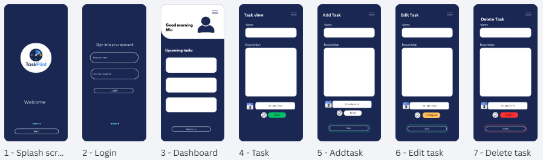

Task Pilot

TaskPilot is a full-stack project management web application
designed for individuals and teams to create, assign, manage,
and monitor tasks.

The project is being developed as a practical exploration of
full-stack software development and engineering, including frontend development,
backend APIs, databases, authentication, authorization, security,
testing, CI/CD and cloud deployment.

## MVP project features
 
 Individual users can 
Create tasks
Edit tasks
Delete tasks
Set task priorities
Set due dates
Track task status
View upcoming tasks

 
 
 Team Users can 

Create teams
Manage team members
Assign tasks
Track team tasks
View task progress
Team insights and analytics

Basic Architecture
Frontend → REST API → Database

TaskPilot will incorporate:
Authentication
Role-based authorization
Input validation
Secure password handling
API security controls
Audit logging
Secure configuration

MVP prototype 

## Planned Features

User authentication
Personal task management
Task CRUD operations
Task status tracking
Team creation and membership
Task assignment
Team administration
Team insights and analytics
Security controls
Testing
Deployment

#Developer and Author 
Diane